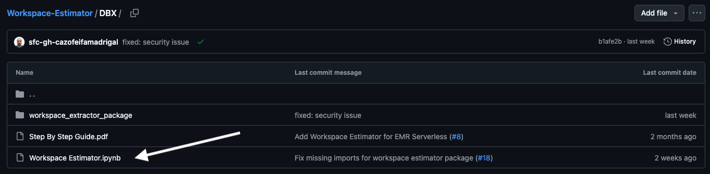
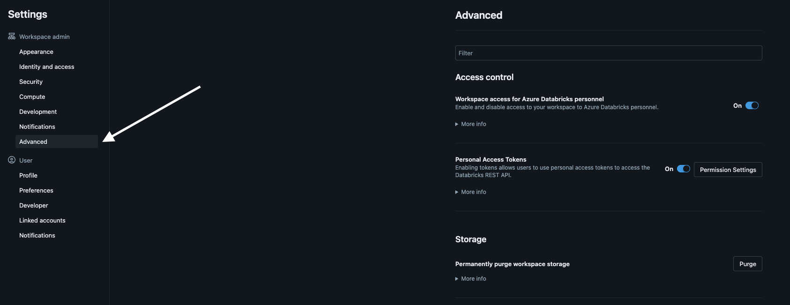
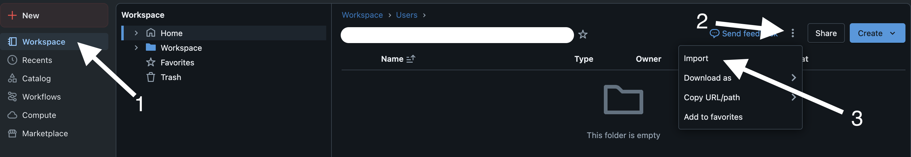
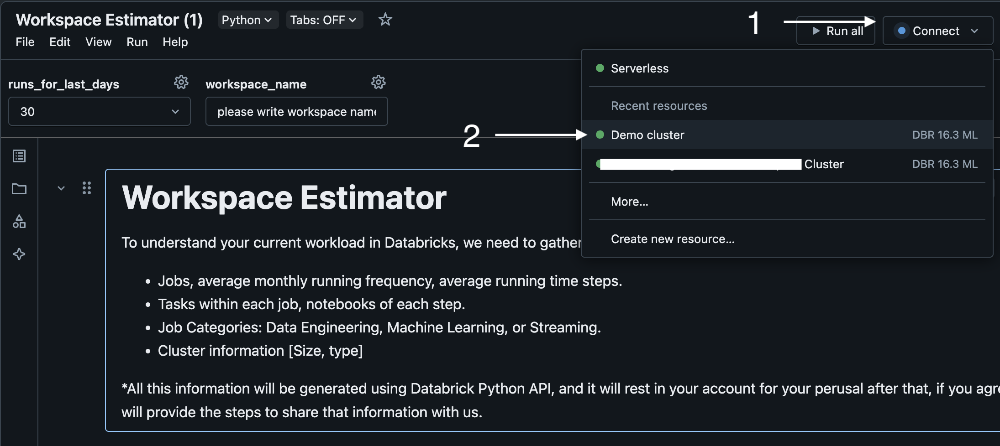
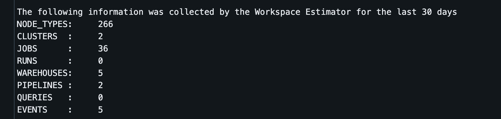

# Workspace Estimator

A comprehensive tool for collecting and analyzing workspace metadata to enable accurate resource estimation.

## 📋 Table of Contents

- [Overview](#overview)
- [Quick Start](#quick-start) 
- [Detailed Installation & Setup](#detailed-installation--setup)
- [Understanding Your Results](#understanding-your-results)
- [Technical Details](#technical-details)
- [Troubleshooting](#troubleshooting)

---

## Overview

### What It Does

The Workspace Estimator automatically collects detailed information from your workspace using the official APIs. It gathers comprehensive data about clusters, jobs, SQL warehouses, pipelines, and historical usage patterns.

### How It Works

The tool connects to your workspace using REST APIs and systematically collects data across 9 key areas:

```
1. Infrastructure Inventory → Node types, cluster configurations
2. Usage Patterns → Cluster events, lifecycle data  
3. Workload Analysis → Job definitions, execution history
4. Performance Metrics → Detailed run statistics, resource consumption
5. SQL Analytics → Warehouse configurations, query history
6. Data Pipelines → DLT pipeline configurations and performance
```

### Business Value

This comprehensive data collection enables:
- **Accurate Resource Estimation**: Based on actual historical usage patterns

---

## Quick Start

### Prerequisites Checklist

Before starting, ensure you have:

- ✅ **Admin access** to your Databricks workspace
- ✅ **API permissions** for clusters, jobs, SQL warehouses, and pipelines
- ✅ **Cluster access** to run the analysis notebook

### 5-Minute Setup

1. **Download**: Get the [Workspace Estimator.ipynb](https://github.com/Snowflake-Labs/Workspace-Estimator/blob/main/DBX/Workspace%20Estimator.ipynb) from GitHub
2. **Import**: Upload the notebook to your Databricks workspace
3. **Configure**: Set historical data range (default: 60 days) and output name
4. **Execute**: Run all cells (5-15 minutes runtime)
5. **Download**: Get your ZIP file with JSON files containing comprehensive workspace data

**Ready for detailed instructions?** → [Jump to full setup guide](#detailed-installation--setup)

---

## Detailed Installation & Setup

### Step 1: Download the Workspace Estimator

1. Go to the [Workspace Estimator repository](https://github.com/Snowflake-Labs/Workspace-Estimator/tree/main) on Snowflake Labs' GitHub

<figure><figcaption><p>Workspace Estimator Repository</p></figcaption></figure>

2. Click on the **DBX** folder to access the Databricks version

<figure><figcaption></figcaption></figure>

3. Click on the [Workspace Estimator.ipynb file](https://github.com/Snowflake-Labs/Workspace-Estimator/blob/main/DBX/Workspace%20Estimator.ipynb) - this contains the analysis notebook

<figure><figcaption><p>Workspace Estimator IPYNB file</p></figcaption></figure>

4. Download the file by clicking **Download** or **Raw** and then saving the file to your computer

<figure><figcaption></figcaption></figure>

### Step 2: Verify Workspace Permissions

1. Log in to your Databricks workspace

2. Navigate to the upper right corner and click on your profile dropdown, then select **Settings**

<figure><figcaption></figcaption></figure>

3. Go to the **Advanced** tab

<figure><figcaption></figcaption></figure>

4. In the **Access Control** section:
   - Verify **Workspace access for Azure Databricks personnel** is set to **On**
   - If not enabled, toggle it **On** (required for comprehensive data collection)

<figure><figcaption><p>Value set On</p></figcaption></figure>

**Additional Permission Requirements:**
- Ensure your account has permissions to read cluster metadata, job configurations, and SQL warehouse settings
- If you encounter permission errors during execution, contact your workspace administrator

### Step 3: Import the Workspace Estimator

1. In your Databricks workspace, go to the **Workspace** tab

2. Click the three dots menu and select **Import**

<figure><figcaption></figcaption></figure>

3. Upload the downloaded `.ipynb` file by:
   - Dragging and dropping the file, or
   - Clicking **browse** to select the file from your computer

<figure><figcaption></figcaption></figure>

4. Click the **Import** button to complete the import process

### Step 4: Configure and Execute the Analysis

1. **Open the imported notebook** from your workspace

2. **Attach to a cluster:**
   - Use an existing cluster or create a new one
   - **Recommended specifications**: Standard_DS3_v2 or equivalent (minimum 1 driver node)
   - Ensure the cluster has internet access for API calls

<figure><figcaption></figcaption></figure>

3. **Configure Collection Parameters:**
   
   **Days of Historical Data:**
   - **Default**: 60 days (recommended for balanced analysis)
   - **Minimum**: 30 days for meaningful patterns
   - **Maximum**: 90+ days for comprehensive long-term analysis
   - *Note: More days = more comprehensive data but longer processing time*

   **Workspace Output Name:**
   - Choose a descriptive name for your analysis (e.g., "Production_Workspace_Dec2024")
   - This will be used to name your output files

4. **Execute the analysis** by running all cells sequentially

<figure><figcaption></figcaption></figure>

**Expected Runtime:** 5-15 minutes depending on workspace size and historical data range

### Step 5: Collect Your Results

1. **Review the analysis summary** in cell #5 output

<figure><figcaption></figcaption></figure>

2. **Download the complete dataset** by clicking the **DOWNLOAD ZIP** button in cell #6

<figure><figcaption></figcaption></figure>

3. **Save the ZIP file** - this contains all collected data for analysis and sharing

---

## Understanding Your Results

### Data Collection Process

The estimator follows a structured approach to gather comprehensive workspace intelligence:

**Step 1: Infrastructure Discovery**
- Scans available compute node types and specifications → `node_types.json`
- Inventories all cluster configurations and current states → `clusters.json`

**Step 2: Historical Analysis** 
- Collects cluster lifecycle events (configurable time range, default 60 days) → `events_{cluster_id}.json` (per cluster)
- Gathers job execution history with detailed task-level metrics → `runs.json`

**Step 3: Workload Profiling**
- Maps job definitions with expanded task configurations → `jobs.json`
- Analyzes SQL warehouse usage → `warehouses.json`

**Step 4: Pipeline Assessment**
- Catalogs Delta Live Tables pipelines and their resource requirements → `pipelines.json`
- Reviews SQL query executions → `queries.json`
- Generates detailed run analysis for each job execution → `runs_details_{run_id}.json` (per run)

### Generated Output Files

The analysis creates a comprehensive dataset with 9 JSON files:

#### 📁 **Core Configuration Files**

- **`node_types.json`** - Available cluster node types and specifications
- **`clusters.json`** - Current cluster inventory and configurations
- **`jobs.json`** - Job definitions with expanded task details
- **`warehouses.json`** - SQL warehouse configurations and settings
- **`pipelines.json`** - Delta Live Tables pipeline configurations

#### 📊 **Historical Analysis Files**

- **`runs.json`** - Complete job execution history
- **`queries.json`** - SQL query execution history and performance
- **`events_{cluster_id}.json`** - Individual cluster lifecycle events (one per cluster)
- **`runs_details_{run_id}.json`** - Detailed analysis for each job run (one per run)

### Using Your Results

**For Internal Analysis:**
- Use the JSON files to understand resource utilization patterns
- Identify over-provisioned or underutilized resources
- Plan capacity requirements based on actual usage data

**For Optimization Consulting:**
- Share the ZIP file with your Account Executive or consultant
- The comprehensive dataset enables accurate resource estimation
- Provides foundation for cost optimization and performance improvement recommendations

---

## Technical Details

### API Endpoints and Data Collection

#### 🏗️ **Infrastructure & Configuration**

##### **Cluster Node Types** (`api/2.0/clusters/list-node-types`) → `node_types.json`
- Available instance types (compute, memory, storage optimized)
- Hardware specifications (CPU cores, RAM, local storage, GPU)
- Regional availability and pricing tiers

##### **Cluster Configurations** (`api/2.0/clusters/list`) → `clusters.json`
- Cluster inventory with IDs, names, and current states
- Node configurations (driver/worker specifications)
- Auto-scaling settings, runtime versions, security configs
- Network settings, storage configurations, and custom tags

#### 📊 **Usage Patterns & Performance**

##### **Cluster Lifecycle Events** (`api/2.0/clusters/events`) → `events_{cluster_id}.json`
Real-time cluster utilization tracking including:
- **Creation & Termination**: When clusters start/stop
- **Scaling Events**: Auto-scaling triggers and resource changes  
- **State Transitions**: Running, idle, and restart patterns
- **Configuration Changes**: Edits and modifications over time

*Key Insight: Identifies actual vs. provisioned capacity usage*

##### **Job Execution History** (`api/2.1/jobs/runs/list`) → `runs.json`
Complete execution analytics with:
- Run timestamps, duration, and success/failure rates
- Task-level performance metrics and resource consumption
- Trigger patterns (scheduled, manual, API-driven)
- Error analysis and troubleshooting data

#### 🔧 **Workload Definitions**

##### **Job Configurations** (`api/2.2/jobs/list`) → `jobs.json`
Comprehensive job inventory including:
- **Task Definitions**: Notebooks, JARs, Python scripts, SQL queries
- **Resource Requirements**: Cluster specifications per job
- **Scheduling**: Cron expressions, triggers, timeout policies
- **Dependencies**: Library requirements and configurations

##### **Detailed Run Analysis** (`api/2.1/jobs/runs/get`) → `runs_details_{run_id}.json`
Deep-dive execution details:
- Resource utilization metrics per task
- Execution logs
- Cluster auto-scaling behavior during runs

#### 🗄️ **SQL & Analytics**

##### **SQL Warehouses** (`api/2.0/sql/warehouses`) → `warehouses.json`
SQL compute resource analysis:
- Warehouse sizes (2X-Small to 4X-Large configurations)
- Auto-stop/resume settings and connection limits
- Usage states

##### **SQL Query Performance** (`api/2.0/sql/history/queries`) → `queries.json`
Query execution intelligence:
- **Performance Metrics**: Execution time, data processed, rows returned
- **Resource Usage**: Warehouse utilization during query execution
- **Usage Patterns**: Query frequency

#### 🚰 **Data Pipelines**

##### **Delta Live Tables** (`api/2.0/pipelines`) → `pipelines.json`
Pipeline resource assessment:
- Pipeline configurations and health status
- Source/target database mappings
- Execution modes (continuous vs. triggered)
- Resource requirements

### Implementation Details

#### **API Authentication & Access**
- Requires appropriate permissions for cluster, job, and workspace metadata
- Respects API rate limits with automatic throttling

#### **Data Processing & Storage**
- **Pagination Handling**: Automatically processes large datasets
- **Progress Tracking**: Visual progress bars for long-running operations  
- **Error Resilience**: Graceful handling of individual API failures
- **Output Format**: Structured JSON files maintaining full API response data

#### **Historical Data Range**
- **Configurable Collection Period**: Default 60 days (customizable)
- **Event-Based Analysis**: Cluster events and job runs from specified timestamp
- **Current State Snapshot**: Real-time configurations and definitions

---

## Troubleshooting

### Common Issues and Solutions

**❌ Permission Errors**
- **Cause**: Insufficient API access permissions
- **Solution**: Verify Personal Access Token has required scopes, contact workspace administrator

**❌ Timeout or Connection Errors**
- **Cause**: Large workspace or network connectivity issues  
- **Solution**: Try smaller date ranges, check cluster internet access, retry during off-peak hours

**❌ Missing Data in Results**
- **Cause**: Some APIs require specific permissions or features not enabled
- **Solution**: Review workspace settings, ensure all required features are enabled

**❌ Notebook Execution Fails**
- **Cause**: Cluster compatibility or resource constraints
- **Solution**: Use recommended cluster specifications, ensure cluster has sufficient resources

**❌ Empty or Incomplete Output Files**
- **Cause**: No data available for specified time period or insufficient permissions
- **Solution**: Extend time range, verify permissions for all workspace features

### Getting Help

If you continue to experience issues:
1. Check the execution logs in each notebook cell for specific error messages
2. Verify all prerequisites are met
3. Contact your Databricks workspace administrator for permission assistance
4. Reach out to your Account Executive for additional support

---

## Next Steps

Once you have successfully collected your workspace data, you can use it for:

- **Internal Analysis**: Resource optimization and performance improvement
- **Cost Management**: Right-sizing recommendations and budget planning  
- **Capacity Planning**: Infrastructure scaling and growth forecasting
- **Professional Assessment**: Share with experts for detailed optimization recommendations

For additional support or questions, contact your Databricks Account Executive or workspace administrator.
