# Getting Started

## Step 1: Download the Workspace Estimator

1. Go to the Snowflake Labs' open-source GitHub, look up for the [Workspace Estimator repository](https://github.com/Snowflake-Labs/Workspace-Estimator/tree/main)

<figure>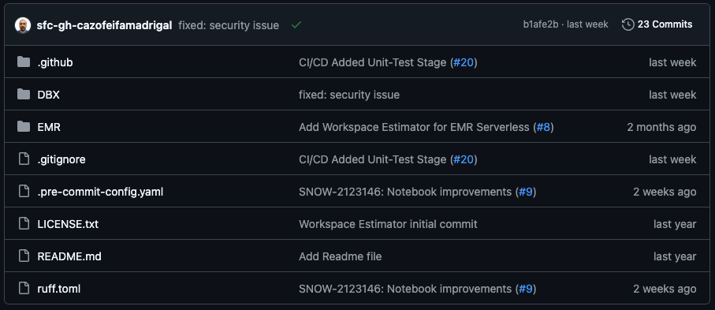<figcaption>
Workspace Estimator Repository
</figcaption></figure>

2. Click on the [Workspace Estimator.ipynb file](https://github.com/Snowflake-Labs/Workspace-Estimator/blob/main/DBX/Workspace%20Estimator.ipynb), this file contains the Notebook.

<figure>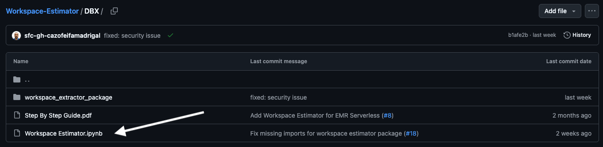<figcaption>
Workspace Estimator IPYNB file
</figcaption></figure>

3. Click to download the file.

<figure>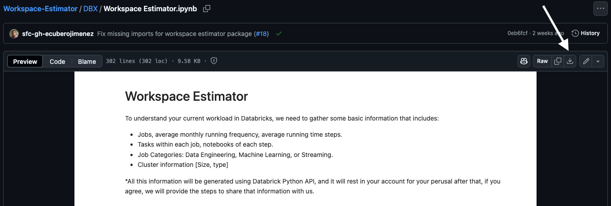<figcaption></figcaption></figure>

## Step 2: Verify Permissions

1. Log in to your Databricks workspace.

2. Verify that you have the required permissions by navigating to the upper right corner of
the screen. Click on the dropdown and select **Settings**.

<figure>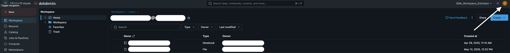<figcaption></figcaption></figure>

3. Go to the **Advanced** tab

<figure>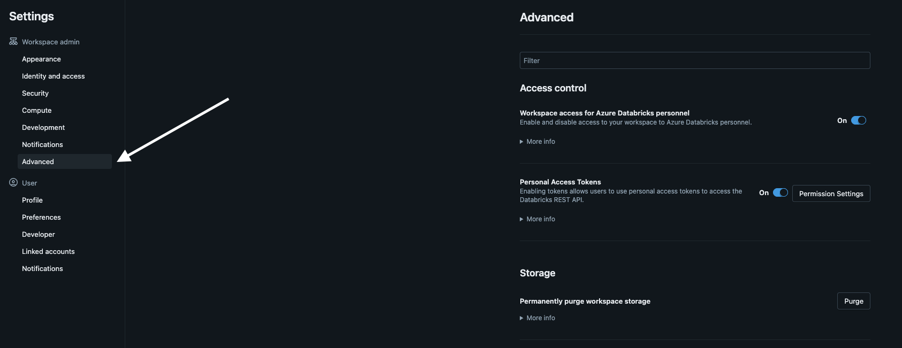<figcaption></figcaption></figure>

4. On **Access Control** section:
   - Verify the option **Workspace access for Azure Databricks personnel** is set **On**, otherwise set it On.

<figure>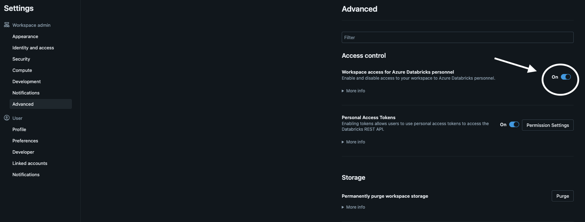<figcaption>
Value set On
</figcaption></figure>

## Step 3: Import the Workspace Estimator

1. Log in to your Databricks workspace.

2. Go to the **Workspace tab**, click on the three dots and then click the **Import option.**

<figure>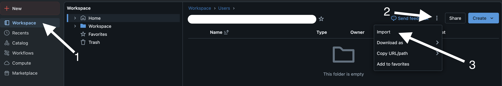<figcaption></figcaption></figure>

3. Drag and drop or browse the previously downloaded zip file.

<figure>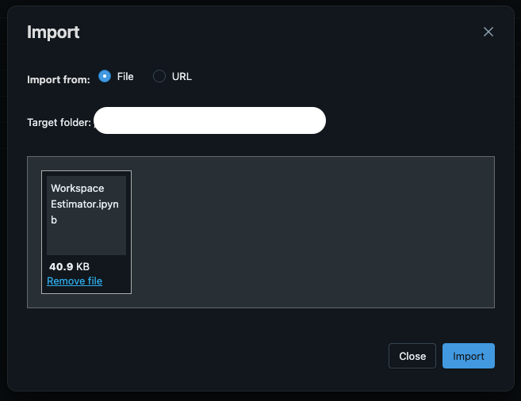<figcaption></figcaption></figure>

4. Click on the **Import** button

## Step 4: Execute the Notebook

1. Open the notebook

2. Attach the notebook to an existing cluster or create a new cluster.

<figure>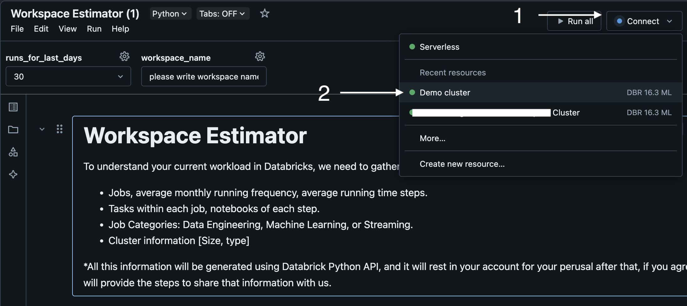<figcaption></figcaption></figure>

3. Select the range of days for pulling the workspace information.

4. Optionally, choose the name for the workspace file information.

5. Then, run all cells.

<figure>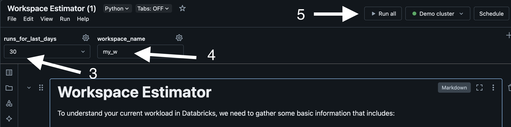<figcaption></figcaption></figure>

## Step 5: Collect the Results

1. After running all cells, save the output result of cell #5

<figure>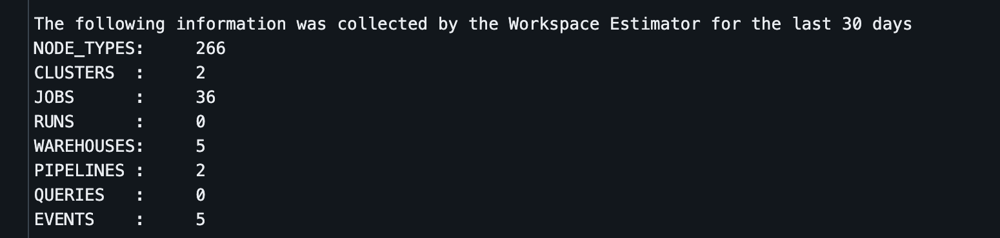<figcaption></figcaption></figure>

2. Click on the DOWNLOAD ZIP button on cell #6

<figure>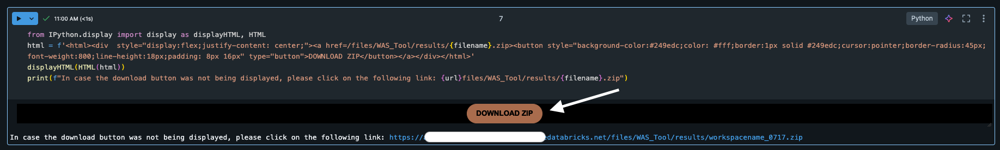<figcaption></figcaption></figure>

3. The output is not sent automatically, once downloaded the output is in a local zip file.

4. When sharing the zip file with your Account Executive, the downloaded zip file will be used to generate the estimation.
