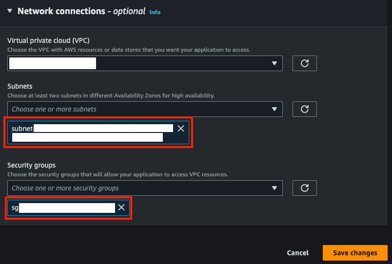
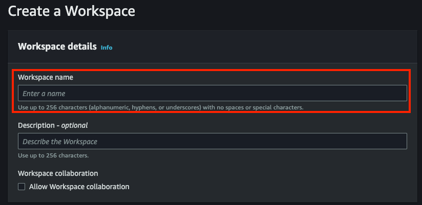
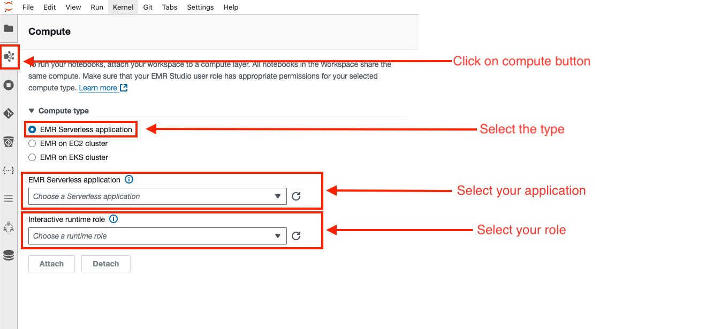
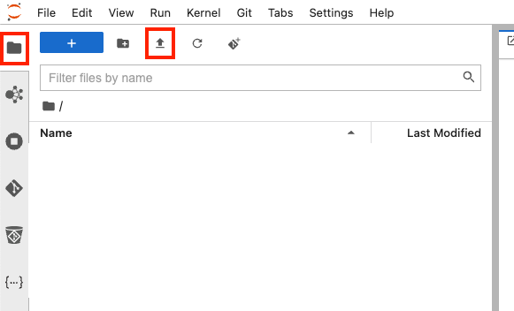
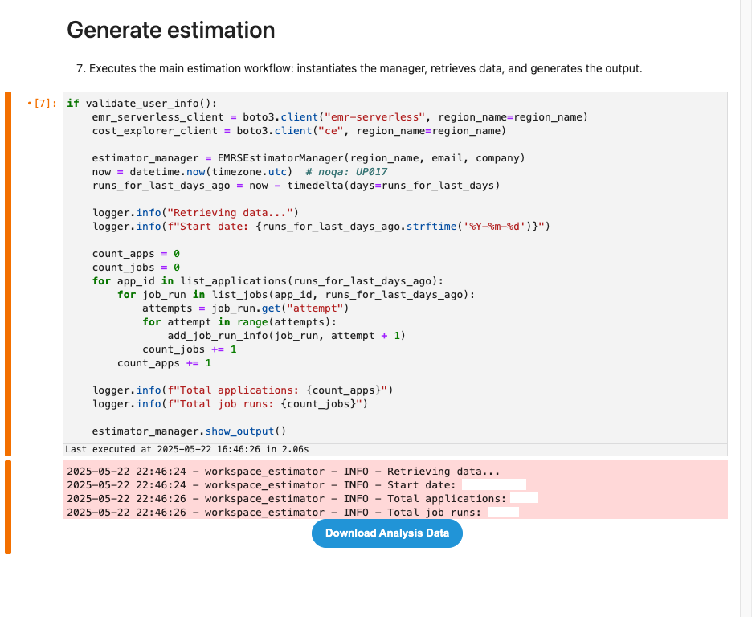

# Workspace Estimator for EMR Serverless: Notebook Execution Guide for Capturing Serverless Metrics

## Introduction
This document serves as a practical guide for utilizing the Workspace Estimator notebook, an essential tool for capturing key metrics to approximate cost consumption for EMR Serverless workloads. The guide details the procedures for environment setup, notebook execution, and gathering data to gain insights into potential expenditures. This preliminary estimation is intended as a first step, setting the stage for a more accurate cost analysis later on.

## Network Configuration and Access to AWS APIs

The "Workspace Estimator" for EMR Serverless needs to access AWS APIs, such as EMR Serverless and Cost Explorer, to gather the necessary information. This communication is done using the Boto3 Python library.

For this communication to work correctly, the EMR Serverless application must be configured within a VPC (Virtual Private Cloud). Within this VPC, the following network configurations are required:
* **Subnets with internet or AWS services outbound access:** The subnets where the EMR Serverless application runs must allow outbound traffic (0.0.0.0/0) through an Internet Gateway (for public subnets) or a NAT Gateway (for private subnets). This ensures the application can call the AWS APIs and get the data.
* **Security Groups with outbound HTTPS traffic:** The security groups associated with the application must allow outbound traffic on port 443 (HTTPS). This is required as AWS APIs communicate securely using HTTPS.

**What to do if you have problems?**
If you are unsure if your network configuration meets these requirements, or if you experience connectivity problems when running the notebook, contact your IT team. They can verify and adjust the network configuration to ensure your EMR Serverless application can access AWS APIs correctly.

## Metrics Collected by the EMR Serverless Estimator
This notebook is designed to gather key information regarding the usage and associated costs of your AWS EMR Serverless applications and job runs. Upon execution, the following metrics and configurations will be obtained directly from your AWS account:

**Application Information (Applications):**
* ID, Name, Type, State, Architecture: Basic identifiers and characteristics of the application.
* Creation and Last Updated Dates: For tracking the application's lifecycle.
* Initial and Maximum Capacity: Configuration of pre-allocated resources and scaling limits (number of workers, vCPU, memory, and disk for executors and drivers).

**Job Run Information (Job Runs):**
* Job Run ID and Application ID: Unique identifiers for the specific job run and its parent application.
* Job Name and Mode: Description and type of the execution.
* State and Start/End Dates: Current condition and duration of the execution.
* Queued and Total Execution Duration: Relevant timings for job performance.
* Monitoring Configuration: Indicates whether S3 monitoring, Managed Persistence, and CloudWatch Logs were enabled for that particular execution.

**Billed Resource Utilization:**
* vCPU-Hours: Consumption of processing units.
* Memory GB-Hours: Consumption of memory.
* Storage GB-Hours: Consumption of storage associated with the execution.

**Costs per Application (from AWS Cost Explorer service):**
* Usage Type: Categorization of expenses (e.g., CPU, Memory, Storage).
* Amount and Unit: The incurred cost and the monetary unit (e.g., USD).
* Date: The day on which the cost was incurred.

The tool consolidates data on your resource configuration, actual billed utilization of vCPU, memory, and storage, and associated costs by usage type. This will enable you to accurately analyze and estimate the expenditure of your EMR Serverless workloads, facilitating informed decision-making for optimization. The execution will result in a ZIP file containing all the organized information for your subsequent analysis.

## Usage of the Output File
Once the notebook completes its execution, a downloadable ZIP file will be generated containing all the collected information. This file includes several CSV files with EMR Serverless application metrics, job run details, and cost data. Please provide this ZIP file for processing and report generation.

## Troubleshooting and Diagnostics (Logs)
The notebook generates log messages that report progress and potential errors. If the execution is unsuccessful or the output file is not generated, review the cell output in EMR Studio. Log messages with ERROR or WARNING will provide clues about the cause of the issue, such as incorrect permissions or configurations. When requesting support, please include these messages for more efficient diagnosis.

## Key Steps Summary Table

| Step                               | Description                                                                                                                                                                                          |
| :--------------------------------- | :--------------------------------------------------------------------------------------------------------------------------------------------------------------------------------------------------- |
| Role Permissions Policy            | Ensure the IAM role for the EMR Serverless application has the necessary permissions by attaching the provided JSON policy.                                                               |
| Create EMR Studio                  | Create an EMR Studio if one doesn't exist. Configure Studio details and network settings.                                                                                                 |
| Create EMR Serverless Application  | Create an EMR Serverless application. Specify application details, release, type (Spark), initial capacity and network settings                                                        |
| Create an EMR Studio Workspace     | Create an EMR Studio Workspace.                                                                                                                                                           |
| Import the Notebook and Set Up Environment | Set the Compute type, upload or import the estimator notebook, and open the notebook.                                                                                                 |
| Execute the Workspace Estimator Notebook | Fill the first code cell with necessary variables, run the notebook cells, and download the output.                                                                                   |

## Role Permissions Policy
Identity and Access Management (IAM) for Amazon EMR is essential for executing the notebook. It's important to note that creating roles and attaching associated policies, such as the one shown below, is generally performed by personnel from the IT department or administrators with the necessary privileges . Not all users have the ability to create IAM roles due to security restrictions. Please ensure the IAM role associated with your EMR Serverless application has the required permissions. The following JSON policy defines the access needed for the notebook to function correctly. This policy must be attached to the role to be used for the **Interactive Runtime Role** that will execute the notebook.

```json
{
    "Version": "2012-10-17",
    "Statement": [
        {
            "Effect": "Allow",
            "Action": [
                "emr-serverless:GetApplication",
                "emr-serverless:GetJobRun",
                "emr-serverless:ListApplications",
                "emr-serverless:ListJobRuns",
                "ce:GetCostAndUsageWithResources",
                "sts:AssumeRole"
            ],
            "Resource": "*"
        }
    ]
}
```
Note: If you do not have the necessary permissions to create or modify IAM roles, please contact your IT team for assistance. They will be able to create the role and attach the required policy.

### Create EMR Studio (If You Don't Have One)
EMR Studio is where you'll write and run your notebooks. You need a Studio to create a Workspace.
* In the EMR Studio section, click on **Studios**.
* Choose **Create Studio** .
* **Studio Details.**
    * **Name:** Type a name for your Studio (e.g., `MyNotebookStudio`).


### Create EMR Serverless Application (If You Don't Have One)
* Launch your Studio.
* Click on **EMR Serverless**.
* Select your studio.
* Click the **Manage Applications** button.


* **Create an Application.**
    * Click on **Applications**.
    * Click the **Create Application** button.


* **Specify the application details.**
    * **Name:** A unique name for your application (e.g., `workspace-estimator-app`).
    * **Release version:** Select the desired EMR version.
    * **Type:** Choose **Spark**.
    * **Initial capacity:** Configure the initial capacity based on your requirements. Consult the EMR Serverless User Guide for further details.


* **Network and Security:**
    * **Network Configuration (Subnets & Security Groups):** Your application needs **subnets** in your VPC and **security groups** to enable connectivity. This allows your notebook to access data with Boto3, ensuring your code runs successfully.



### Create EMR Studio Workspace (If You Don't Have One)
* Launch your Studio.
* Click on **EMR Serverless**.
* Select your studio.
* Click the **Manage Applications** button.


* **Create Workspace.**
    * Click on **Workspaces**.
    * Click the **Create Workspace** button.


* **Specify the workspace details.**
    * Provide a name for your workspace (e.g., `estimator-workspace`).



### Import The Notebook And Set Up The Environment
* Open the workspace.
* Select your workspace.
* Click on **Quick launch** button.


* **Set up the Compute type.**
    * In the second button of the left sidebar, you will find the section called **Compute**.
    * Select the type named **EMR Serverless application**.
    * Choose your application and the role with the policy you created above



* In the workspace environment, upload or import the workspace estimator notebook.
* In the first button of the left sidebar, you will find the file explorer.
* Click on the import button and select the notebook file.



### Execute The Workspace Estimator Notebook
* Open the uploaded notebook.
* **Configure Initial Variables:**
    * Navigate to the first code cell of the notebook. Here, you will need to update the following variables with your specific information:
        * `region_name`: Enter the AWS region name where your EMR Serverless resources reside (e.g., `"us-west-2"`).
        * `email`: Provide your email address (e.g., `"user@example.com"`).
        * `company`: Enter your company name (e.g., `"Snowflake"`).
        * `runs_for_last_days`: This value determines the number of days prior to the current date for which job run data will be collected. The default value is 15 days. You can adjust it according to your desired analysis period.
        ```python
        #Example
        region_name = "us-west-2"
        email = "your_email@example.com"
        company = "YourCompany"
        runs_for_last_days = 30 # For example, for the last 30 days
        ```
* **Execute the Notebook Cells**
* **Review Output and Download File:**
    * Once the execution is complete, the last cell of the notebook should display a download button.
    * Click this button to download the generated ZIP file, which will contain all the organized metrics and cost information for your subsequent analysis.

