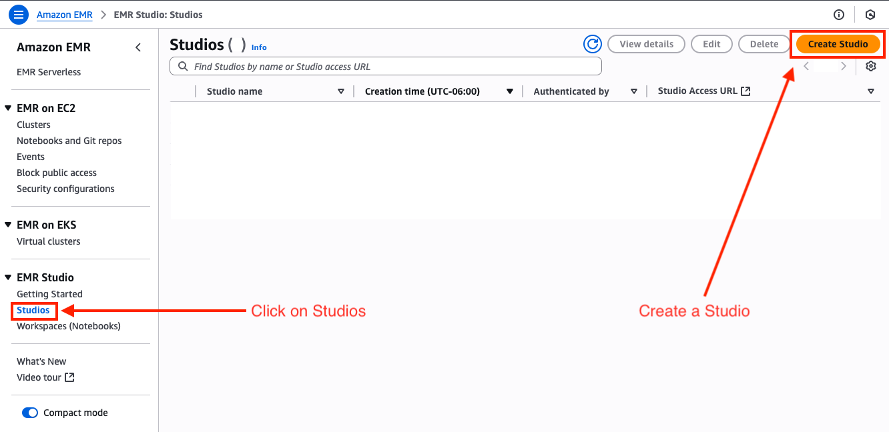
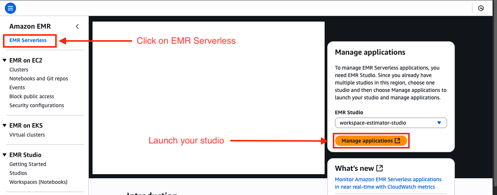
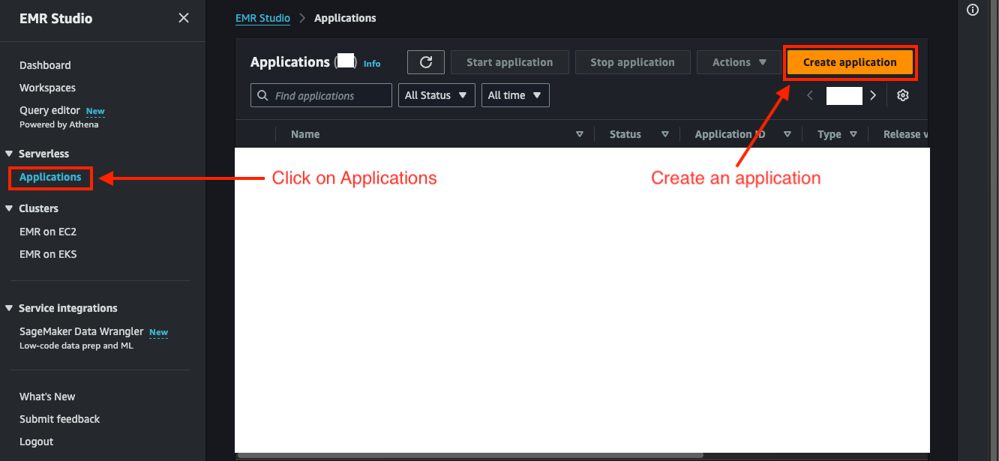
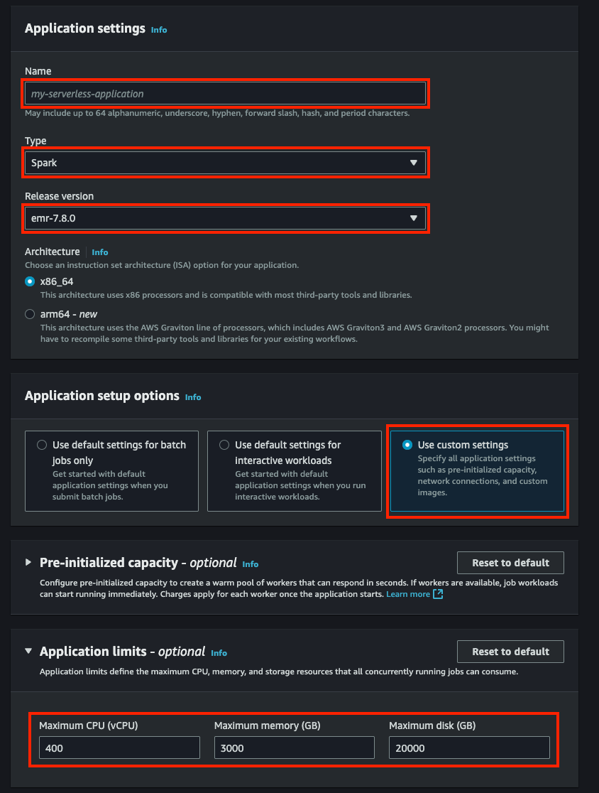
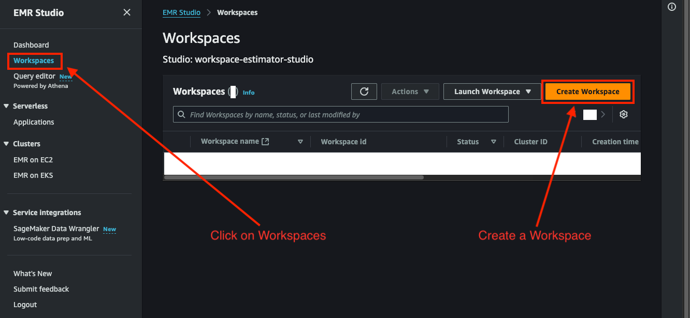
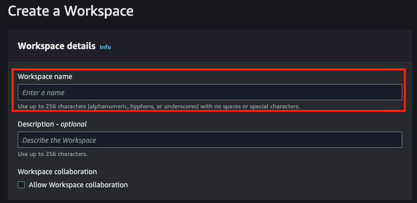
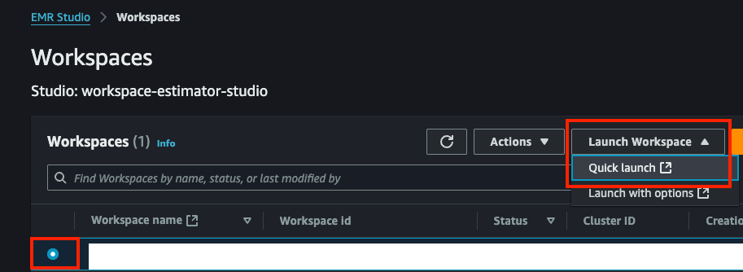
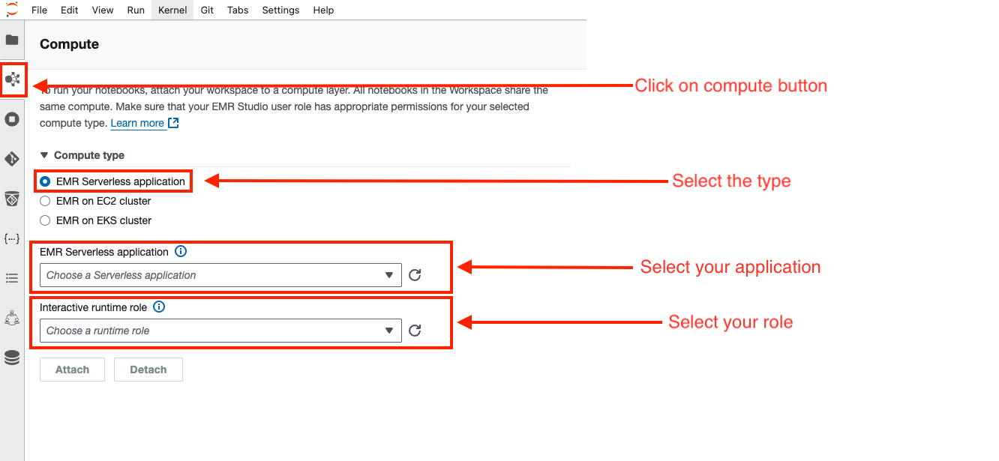
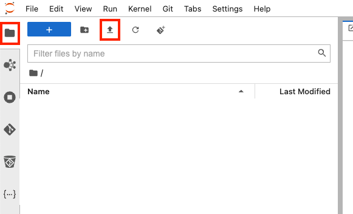
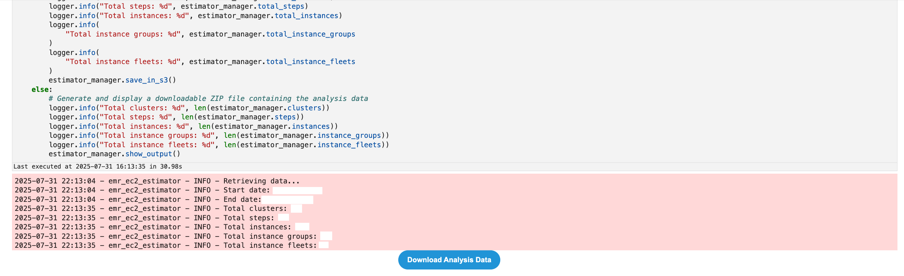

# Workspace Estimator for EMR: Notebook Execution Guide for Capturing EC2 Metrics

## Introduction
This guide serves as a practical guide for utilizing the Workspace Estimator notebook, a tool for collecting key metrics to approximate cost consumption for EMR EC2 instances. The guide details the procedures for environment setup, notebook execution, and gathering data to gain insights into potential expenditures. This preliminary estimation is intended as a first step, setting the stage for a more accurate cost analysis later on.

The "Workspace Estimator" notebook offers two distinct methods for handling the output files, providing flexibility based on your workload size:
* **Option 1: Direct Download (Default):** Upon successful execution, a download button will appear in the notebook's final cell. This option is designed for standard workloads, allowing you to download a ZIP file containing all the collected metrics directly to your local machine.
* **Option 2: S3 Upload (Optional):** For larger workloads where direct download might be impractical due to memory or timeout issues, you can configure the notebook to automatically upload the output ZIP file to an Amazon S3 bucket. This method requires you to set specific variables in the first code cell and is recommended for handling extensive datasets.

## Network Configuration and Access to AWS APIs

The "Workspace Estimator" for EMR EC2 needs to access AWS API (EMR) to gather the necessary information. This communication is done using the Boto3 Python library.

For this communication to work correctly, the EMR Serverless application must be configured within a VPC (Virtual Private Cloud). Within this VPC, the following network configurations are required:
* **Subnets with internet or AWS services outbound access:** The subnets where the EMR Serverless application runs must allow outbound traffic (0.0.0.0/0) through an Internet Gateway (for public subnets) or a NAT Gateway (for private subnets). This ensures the application can "call" the AWS APIs and get the data.
* **Security Groups with outbound HTTPS traffic:** The security groups associated with the application must allow outbound traffic on port 443 (HTTPS). This is required as AWS APIs communicate securely using HTTPS.

**What to do if you have problems?**
If you are unsure if your network configuration meets these requirements, or if you experience connectivity problems when running the notebook, contact your IT team. They can verify and adjust the network configuration to ensure your EMR Serverless application can access AWS APIs correctly.

## Metrics Collected by the EMR EC2 Estimator
This notebook is designed to gather key information regarding the usage and associated costs of your AWS EMR clusters, steps, instances, instance groups, and instance fleets. Upon execution, the following metrics and configurations will be obtained directly from your AWS account:

* **Execution Detail (`execution_detail.csv`)**: This file provides general metadata about the estimator's own execution. It includes an `execution_id`, `email`, `company`, `region`, `version`, `timestamp`, `runs_for_last_days`, `total_clusters`, `total_steps`, `total_instances`, `total_instances_groups`, and `total_instances_fleets`.
* **Cluster List (`clusters_list.csv`)**: Provides an overview and configuration details for each EMR cluster detected. It contains information such as `cluster_id`, `status`, `creation_date_time`, `normalized_instance_hours`, `release_label`, and `applications`.
* **Step List (`steps_list.csv`)**: Offers a summary of each job execution (Step) within the EMR clusters. It includes the `step_id`, `cluster_id`, `state`, and `duration in seconds`.
* **Instance Groups List (`instance_groups_list.csv`)**: Provides configuration details for each EMR instance group. It details the `instance_group_id`, `cluster_id`, `market`, `instance_type`, `requested_instance_count`, and `running_instance_count`.
* **Instance Fleets List (`instance_fleets_list.csv`)**: Provides configuration details for each EMR instance fleet. It includes the `instance_fleet_id`, `instance_fleet_type`, `state`, `target_on_demand_capacity`, `target_spot_capacity`, and `instance_type_specifications_key`.
* **Instances List (`instances.csv`)**: Provides the most granular details regarding billable resource consumption at the EC2 instance level. It includes the `instance_id`, `cluster_id`, `market`, `instance_type`, and `duration in seconds`.

The tool consolidates data on your resource configuration and associated costs by usage type. This enables you to accurately analyze and estimate the expenditure of your EMR EC2 workloads. The execution will result in a ZIP file containing all the organized information for your subsequent analysis.

## Usage of the Output File
Once the notebook completes its execution, a downloadable ZIP file will be generated containing all the collected information. This file includes several CSV files with EMR EC2 metrics. This ZIP file is requested to be provided for processing and report generation.

## Troubleshooting and Diagnostics (Logs)
The notebook generates log messages that report progress and potential errors. If the execution is unsuccessful or the output file is not generated, review the cell output in EMR Studio. Log messages with ERROR or WARNING will provide clues about the cause of the issue, such as incorrect permissions or configurations. When requesting support, please include these messages for more efficient diagnosis.

## Key Steps Summary Table

| Step | Description |
| :--- | :--- |
| Role Permissions Policy | Ensure the IAM role for the EMR Serverless application has the necessary permissions by attaching the provided JSON policy.|
| Create EMR Studio | Create an EMR Studio if one doesn't exist. Configure Studio details and network settings.|
| Create EMR Serverless Application | Create an EMR Serverless application. Specify application details, release, type (Spark), initial capacity and network settings.|
| Create an EMR Studio Workspace | Create an EMR Studio Workspace.|
| Import the Notebook and Set Up Environment | Set the Compute type, upload or import the estimator notebook, and open the notebook.|
| Execute the Workspace Estimator Notebook | Fill the first code cell with necessary variables, run the notebook cells, and download the output.|

## Role Permissions Policy
Identity and Access Management (IAM) for Amazon EMR is essential for executing the notebook. It's important to note that creating roles and attaching associated policies, such as the one shown below, is generally performed by personnel from the IT department or administrators with the necessary privileges. Not all users have the ability to create IAM roles due to security restrictions.

Please ensure the IAM role associated with your EMR Serverless application has the required permissions. The following JSON policy defines the access needed for the notebook to function correctly. This policy must be attached to the role to be used for the **Interactive Runtime Role** that will execute the notebook.

The provided IAM permissions policy is designed exclusively to enable the notebook's communication with the AWS EMR API for metrics and cost collection. It is crucial to understand that this policy does not cover other permissions required for the general operation of a notebook within an EMR Studio Workspace, such as S3 access or resource creation. Any additional permissions for EMR Studio functionality or accessing your own resources must be managed by your IT team or AWS account administrators.

### Trust policy
```json
{
    "Version": "2012-10-17",
    "Statement": [
        {
            "Effect": "Allow",
            "Principal": {
                "Service": "emr-serverless.amazonaws.com"
            },
            "Action": "sts:AssumeRole"
        }
    ]
}
```

### Permissions policies
```json
{
    "Version": "2012-10-17",
    "Statement": [
        {
            "Effect": "Allow",
            "Action": [
                "elasticmapreduce:ListClusters",
                "elasticmapreduce:DescribeCluster",
                "elasticmapreduce:ListSteps",
                "elasticmapreduce:DescribeStep",
                "elasticmapreduce:ListInstances",
                "elasticmapreduce:ListInstanceGroups",
                "elasticmapreduce:ListInstanceFleets"
            ],
            "Resource": "*"
        }
    ]
}
```

### S3 Permissions Policy for Optional Upload (Optional)
If you choose to use the S3 upload option for large workloads, the IAM role associated with your EMR Studio Workspace must also have permissions to interact with Amazon S3. The following JSON policy defines the required access. This policy should be created and attached by your IT team or an administrator with the necessary privileges.

```json
{
    "Version": "2012-10-17",
    "Statement": [
        {
            "Effect": "Allow",
            "Action": [
                "s3:PutObject"
            ],
            "Resource": [
                "arn:aws:s3:::<your_bucket_name>",
                "arn:aws:s3:::<your_bucket_name>/*"
            ]
        }
    ]
}
```

### Create EMR Studio (If You Don't Have One)
EMR Studio is where you'll write and run your notebooks. You need a Studio to create a Workspace.
* In the EMR Studio section, click on **Studios**.
* Choose **Create Studio**.
* **Studio Details.**
    * **Name:** Type a name for your Studio (e.g., `MyNotebookStudio`).



### Create EMR Serverless Application (If You Don't Have One)
* Launch your Studio.
* Click on **EMR Serverless**.
* Select your studio.
* Click the **Manage Applications** button.



* **Create an Application.**
    * Click on **Applications**.
    * Click the **Create Application** button.



* **Specify the application details.**
    * **Name:** A unique name for your application (e.g., `workspace-estimator-app`).
    * **Release version:** Select the desired EMR version.
    * **Type:** Choose **Spark**.
    * **Initial capacity:** Configure the initial capacity based on your requirements. Consult the EMR Serverless User Guide for further details.



* **Network and Security:**
    * **Network Configuration (Subnets & Security Groups):** Your application needs subnets in your VPC and security groups to enable connectivity. This allows your notebook to access data with Boto3, ensuring your code runs successfully.

### Create EMR Studio Workspace (If You Don't Have One)
* Launch your Studio.
* Click on **EMR Serverless**.
* Select your studio.
* Click the **Manage Applications** button.


* **Create Workspace.**
    * Click on **Workspaces**.
    * Click the **Create Workspace** button.



* **Specify the workspace details.**
    * Provide a name for your workspace (e.g., `estimator-workspace`).



### Import The Notebook And Set Up The Environment
* Open the workspace.
* Select your workspace.
* Click on **Quick launch** button.



* **Set up the Compute type.**
    * In the second button of the left sidebar, you will find the section called **Compute**.
    * Select the type named **EMR Serverless application**.
    * Choose your application and the role with the policy you created above.



* In the workspace environment, upload or import the workspace estimator notebook.
* In the first button of the left sidebar, you will find the file explorer.
* Click on the import button and select the notebook file.



### Execute The Workspace Estimator Notebook
* Open the uploaded notebook.
* **Configure Initial Variables:**
    * Navigate to the first code cell of the notebook. Here, you will need to update the following variables with your specific information:
        * `region_name`: Enter the AWS region name where your EMR Serverless resources reside (e.g., `"us-west-2"`).
        * `email`: Provide your email address (e.g., `"user@example.com"`).
        * `company`: Enter your company name (e.g., `"Snowflake"`).
        * `runs_for_last_days`: This value determines the number of days prior to the current date for which job run data will be collected. The default value is 15 days, and you can adjust it according to your desired analysis period.
    * **Optional S3 Configuration (for large workloads):** If you intend to save the output files to an Amazon S3 bucket, configure the following variables: `s3_bucket_name` (e.g., `"my-emr-we-reports"`) and `s3_folder_name` (e.g., `"workspace-estimator-results"`).

```python
#Example
region_name = "us-west-2"
email = "your_email@example.com"
company = "YourCompany"
runs_for_last_days = 30 # For example, for the last 30 days

# If you want to save the files in S3, set these values
s3_bucket_name = "my-emr-we-reports"
s3_folder_name = "workspace-estimator-results"
```

* **Execute the Notebook Cells**.
* **Option 1: Review Output and Download File:**
    * Once the execution is complete, the last cell of the notebook should display a download button.
    * Click this button to download the generated ZIP file, which will contain all the organized metrics and cost information for your subsequent analysis.



* **Option 2: S3 Upload (Optional)**
    * If you have configured the S3 variables in the first notebook cell, the output files will be automatically uploaded to the specified Amazon S3 bucket instead of generating a download button.
